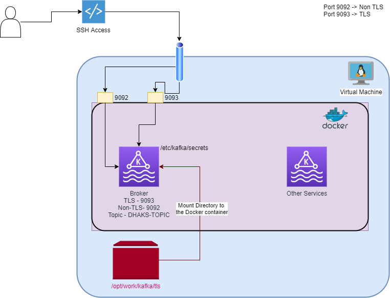

# Intro

Kafka provides event streaming to enable a near realtime events to publish/consume by the clients. Please click [here](https://kafka.apache.org/) for more details about Kafka.

This repo will help us to understand how to easy it is to enable SSL on Kafka Broker.


Below is the diagram to understand the setup with Docker-compose, I do have CentOS based Virtual Machine, which has all the required tools installed. I use gitbash on windows system to access the VM and expose certain ports to the host system to access the docker container services.



# Prerequisite
- docker 
- docker-compose
- keytool (Java utility)

# Project
```sh
docker-compose.yaml
|tls|
# KeyStore config
|___| broker-ks-creds  # Contains password for keystore 
|___| key-creds        # Contains password for the key(alias) for keystore
|___| kafka.broker.keystore.jks  
# Trust store
|___| truststore-creds # Contains password for trust store 
|___| kafka.broker.truststore.jks 
# TLS Client configuration 
|___| client-ssl.properties 


```


# 1. How to generate keystore & Truststore

Any server requires at least a Keystore(to serve the requests) and a Truststore (To make the request to other servers/systems). Similarly, we will need to create both -

## 1. Generate Keystore
Please run the below command to generate it
```sh
$ keytool -genkeypair -dname "CN=localhost, OU=Integartion, O=dhaka, L=New Delhi, ST=New Delhi, C=IN"  -keypass password  -storepass changeit -validity 9999 -keystore kafka.broker.keystore.jks -alias localhost -ext SAN=DNS:localhost,IP:127.0.0.1

#Warning:
#The JKS keystore uses a proprietary format. It is recommended to migrate to PKCS12 which is an industry standard format using "keytool -importkeystore -srckeystore kafka.broker.keystore.jks -destkeystore kafka.broker.keystore.jks -deststoretype pkcs12".
```
We have successfully created a keystore.
### Verify

```sh
 keytool -list -keystore kafka.broker.keystore.jks -storepass changeit
#Keystore type: jks
#Keystore provider: SUN

#Your keystore contains 1 entry

#localhost, Mar 10, 2021, PrivateKeyEntry,
#Certificate fingerprint (SHA1): F7:FD:F1:13:20:D0:54:C6:C8:7E:EB:22:1D:2A:2D:C7:30:DD:2C:28

#Warning:
#The JKS keystore uses a proprietary format. It is recommended to migrate to PKCS12 which is an industry standard format using "keytool -importkeystore -srckeystore kafka.broker.keystore.jks -destkeystore kafka.broker.keystore.jks -deststoretype pkcs12".

```
You might have noticed the keystore contains 1 entry with the details.


## 2. Generate Truststore
Truststore is used by any client to make a secure request to any server which support TLS.
> I will import the public cert of the same keystore.

- How to import a public cert?
```sh
keytool -exportcert -keystore kafka.broker.keystore.jks  -storepass changeit -alias localhost -file public.cert
#Certificate stored in file <public.cert>

```
- Create a truststore using the exported file

```sh
 keytool -importcert -keystore kafka.broker.truststore.jks  -storepass changeit -alias localhost -file public.cert --noprompt
Certificate was added to keystore
```

Verify the truststore
```sh
$ keytool -list -keystore kafka.broker.truststore.jks -storepass changeit
#Keystore type: jks
#Keystore provider: SUN

#Your keystore contains 1 entry

#localhost, Mar 10, 2021, trustedCertEntry,
#Certificate fingerprint (SHA1): F7:FD:F1:13:20:D0:54:C6:C8:7E:EB:22:1D:2A:2D:C7:30:DD:2C:28

```

So far we have create a keystore and truststore for Kafka broker.
- kafka.broker.```keystore```.jks
- kafka.broker.```truststore```.jks

# 2. Generate Kafka credentials & Clients (Consumer/Producer) Credentials
Kafka requires the passwords to open the keystore/truststore and use the certificate. Below are the files which contains password strings -
```sh
$ echo 'changeit' > broker-ks-creds && \ # Contains password for keystore 
$ echo 'password' > key-creds && \         # Contains password for the key(alias) for keystore

# Trust store
$ echo 'changeit' >truststore-creds # Contains password for trust store 


# Generate Kafka Consumer/Producer TLS config file
$cat <<EOT >> client-ssl.properties
bootstrap.servers=broker:9093
security.protocol=SSL
ssl.truststore.location=/etc/kafka/secrets/kafka.broker.truststore.jks
ssl.truststore.password=changeit
ssl.keystore.location=/etc/kafka/secrets/kafka.broker.keystore.jks
ssl.keystore.password=changeit
ssl.key.password=password
EOT

## List all the files
$ ls -L
#-rw-r--r-- 1 root root    9 Mar 10 03:13 broker-ks-creds
#-rw-r--r-- 1 root root 2019 Mar 10 02:54 kafka.broker.keystore.jks
#-rw-r--r-- 1 root root 1339 Mar 10 03:06 kafka.broker.truststore.jks
#-rw-r--r-- 1 root root    9 Mar 10 03:13 key-creds
#-rw-r--r-- 1 root root 1273 Mar 10 03:01 public.cert
#-rw-r--r-- 1 root root    9 Mar 10 03:13 truststore-creds
#-rw-r--r-- 1 root root  280 Mar 10 21:39 client-ssl.properties
```

So far we have created all the required files to enable TLS on Kafka broker.

# 3. Configure Docker-compose service
Kafka provides a quick running guide with multiple ways of your choice. However, I'll be using docker-compose to quickly spin up the containers in my local virutal machine.

> Please find the latest docker-compose file [here](https://docs.confluent.io/platform/current/quickstart/ce-docker-quickstart.html), from official documentations.

docker-compose file has multiple services, we will change some of the configuration under ```broker``` service, Please comment and add details as mentioned below under environment variable section -
```yaml

  broker:
    image: confluentinc/cp-server:6.1.0
    hostname: broker
    container_name: broker
    depends_on:
      - zookeeper
    ports:
      - "9092:9092"
      - "9101:9101"
      ## TLS Security Port
      - "9093:9093"
    environment:
      KAFKA_BROKER_ID: 1
      KAFKA_ZOOKEEPER_CONNECT: 'zookeeper:2181'
      ## ** *********************************************
      #  ** Please comment below mentioned 2 variables ** 
      ## ** *********************************************      
      #KAFKA_LISTENER_SECURITY_PROTOCOL_MAP: PLAINTEXT:PLAINTEXT,PLAINTEXT_HOST:PLAINTEXT
      #KAFKA_ADVERTISED_LISTENERS: PLAINTEXT://broker:29092,PLAINTEXT_HOST://localhost:9092

      KAFKA_METRIC_REPORTERS: io.confluent.metrics.reporter.ConfluentMetricsReporter
      KAFKA_OFFSETS_TOPIC_REPLICATION_FACTOR: 1
      KAFKA_GROUP_INITIAL_REBALANCE_DELAY_MS: 0
      KAFKA_CONFLUENT_LICENSE_TOPIC_REPLICATION_FACTOR: 1
      KAFKA_CONFLUENT_BALANCER_TOPIC_REPLICATION_FACTOR: 1
      KAFKA_TRANSACTION_STATE_LOG_MIN_ISR: 1
      KAFKA_TRANSACTION_STATE_LOG_REPLICATION_FACTOR: 1
      KAFKA_JMX_PORT: 9101
      KAFKA_JMX_HOSTNAME: localhost
      KAFKA_CONFLUENT_SCHEMA_REGISTRY_URL: http://schema-registry:8081
      CONFLUENT_METRICS_REPORTER_BOOTSTRAP_SERVERS: broker:29092
      CONFLUENT_METRICS_REPORTER_TOPIC_REPLICAS: 1
      CONFLUENT_METRICS_ENABLE: 'true'
      CONFLUENT_SUPPORT_CUSTOMER_ID: 'anonymous'
      ## ** ************************************************************ 
      ## ** Please add below mentioned extra variables to enable TLS  **
      #  ** Security TLS Enablement                                   **
      ## ** ************************************************************
      KAFKA_SSL_KEYSTORE_FILENAME: kafka.broker.keystore.jks
      KAFKA_SSL_KEYSTORE_CREDENTIALS: broker-ks-creds
      KAFKA_SSL_KEY_CREDENTIALS: key-creds
      KAFKA_SSL_TRUSTSTORE_FILENAME: kafka.broker.truststore.jks
      KAFKA_SSL_TRUSTSTORE_CREDENTIALS: truststore-creds
      KAFKA_LISTENER_SECURITY_PROTOCOL_MAP: SSL:SSL,PLAINTEXT:PLAINTEXT,PLAINTEXT_HOST:PLAINTEXT 
      KAFKA_ADVERTISED_LISTENERS: PLAINTEXT://broker:29092,PLAINTEXT_HOST://localhost:9092,SSL://localhost:9093
      ## ** ************************************************************ 
      ## ** Please add below mentioned volume to mount and enable access of 
      # ** the keystore, truststore and other credentials files under 
      # ** the directory "/etc/kafka/secrets", 
      # ** Note: the direcotry is hardcoded under official docker image so 
      # ** we will mount on it.                                       **
      #  ** Security TLS Enablement                                   **
      ## ** ************************************************************    
    
    volumes:
      - ./tls/:/etc/kafka/secrets #


```

Now we have configured everything which is required for the TLS. Please make sure its only Broker service we want to update so the clients can have both options for TLS and Non-TLS communication on the port 9093 and 9091 respectively.


# 4. How to run the services?
Once you have configured the keystore, truststore, credentials and the docker-compose service, it just one command you will need to fire.

```sh
$ # Make sure you have copy all the artifacts at your prefered location to work, exmple '/opt/kafka/'
$ # export KAFKA_ARTIFACT_PATH= <PATH TO KAFKA ARTIFCAT>
$ export KAFKA_ARTIFACT_PATH= /opt/kafka/
$ cd $KAFKA_ARTIFACT_PATH
$ # Start the services 
$ docker-compose -d
# Starting zookeeper ... done
# Starting broker    ... done
# Starting schema-registry ... done
# Starting connect         ... done
# Starting rest-proxy      ... done
# Starting ksqldb-server   ... done
# Starting control-center  ... done
# Starting ksqldb-cli      ... done
# Starting ksql-datagen    ... done

## Verify the service is up and running
$ docker-compose ps
#     Name                    Command               State                                    Ports
# -------------------------------------------------------# -------------------------------------------------------# --------------------
# broker            /etc/confluent/docker/run        Up       0.0.0.0:9092->9092/tcp, 0.0.0.0:9093->9093/tcp, 0.0.0.0:9101->9101/tcp
# connect           /etc/confluent/docker/run        Up       0.0.0.0:8083->8083/tcp, 9092/tcp
# control-center    /etc/confluent/docker/run        Up       0.0.0.0:9021->9021/tcp
# ksql-datagen      bash -c echo Waiting for K ...   Exit 1
# ksqldb-cli        /bin/sh                          Up
# ksqldb-server     /etc/confluent/docker/run        Up       0.0.0.0:8088->8088/tcp
# rest-proxy        /etc/confluent/docker/run        Up       0.0.0.0:8082->8082/tcp
# schema-registry   /etc/confluent/docker/run        Up       0.0.0.0:8081->8081/tcp
# zookeeper         /etc/confluent/docker/run        Up       0.0.0.0:2181->2181/tcp, 2888/tcp, 3888/tcp


```
> Note: Sometimes the broker service doesn't start, (as per my knowledge it wait for zookeper to start and if it couldn't connect then stop itself), don't worry just issue the same command once again. :) 

Congratulations! you have Kafka in your local/guest/remote host up and running.

# How to connect to the broker using TLS and exchange messages?

We will using the command line tool to connect with Kafka broker as described on the officail website. Then we will configure both producer and the consumer with TLS using the same keystore and the truststore (In real life, these keystore and truststore may be different).

## Client configuration
We will use client-ssl.properties file to provide the details of keystore and the truststore.

client-ssl.properties
```
bootstrap.servers=broker:9093
security.protocol=SSL
ssl.truststore.location=/etc/kafka/secrets/kafka.broker.truststore.jks
ssl.truststore.password=changeit
ssl.keystore.location=/etc/kafka/secrets/kafka.broker.keystore.jks
ssl.keystore.password=changeit
ssl.key.password=password

```
Preety much simple configuration, now we will use this property file for both Message producer and the consumer.

## Create the Topic to send/receive the messages on broker
> We will use Non TLS port 9092 for this communication.

```sh
# 1. Login to docker container console
$ docker exec -it broker bash
# 2. Create a topic -> DHAKS-TOPIC
[appuser@broker ~]$/bin/kafka-topics --create --bootstrap-server localhost:9092  --topic DHAKS-TOPIC
# Created topic DHAKS-TOPIC.
# 3. Get Details of the created topic
[appuser@broker ~]$ /bin/kafka-topics --describe --topic DHAKS-TOPIC --bootstrap-server localhost:9092
# Topic: DHAKS-TOPIC      PartitionCount: 1       ReplicationFactor: 1    Configs:
#        Topic: DHAKS-TOPIC      Partition: 0    Leader: 1       Replicas: 1     Isr: 1  Offline:
# We do have created a topic DHAKS-TOPIC successfully!

```

## Send Messages to the Broker
We will connect to the topic __DHAKS-TOPIC__ using TLS port (9093), this will requirs the kafka producer to the file __client-ssl.properties__ for keystore and truststore in order to send the messages

__client-ssl.properties__ file location under docker container : __/etc/kafka/secrets/client-ssl.properties__

```sh
# 1. Login to docker container console
$ docker exec -it broker bash
# 2. Use kafka producer to send messages, This tool will prompt you the one message per line to send to broker.
/bin/kafka-console-producer --topic DHAKS-TOPIC --bootstrap-server localhost:9093 --producer.config /etc/kafka/secrets/client-ssl.properties
>This is first Message over the TLS
>This is second Message over the TLS
>bye!
>^C
# We sent 3 messages successfuly to the kafka broker, please process ctrl+C to exit.

```

## Receive the Messages from the Broker
Similarily, We will connect to the topic __DHAKS-TOPIC__ using TLS port (9093), this will requirs the kafka consumer to the file __client-ssl.properties__ for keystore and truststore in order to send the messages

__client-ssl.properties__ file location under docker container : __/etc/kafka/secrets/client-ssl.properties__


```sh
# 1. Login to docker container console
$ docker exec -it broker bash
# 2. Use kafka producer to send messages, This tool will prompt you the one message per line to send to broker.
 /bin/kafka-console-consumer --topic DHAKS-TOPIC --bootstrap-server localhost:9093 --consumer.config /etc/kafka/secrets/client-ssl.properties
# This is first Message over the TLS
# This is second Message over the TLS
# bye!
#^C Processed a total of 3 messages

## Great, We have received all 3 messages from the Kafka broker.
$

```


Thanks for you time! Let me know if you have any other questions.


# References
- https://kafka.apache.org/quickstart
- https://docs.confluent.io/platform/current/kafka/authentication_ssl.html